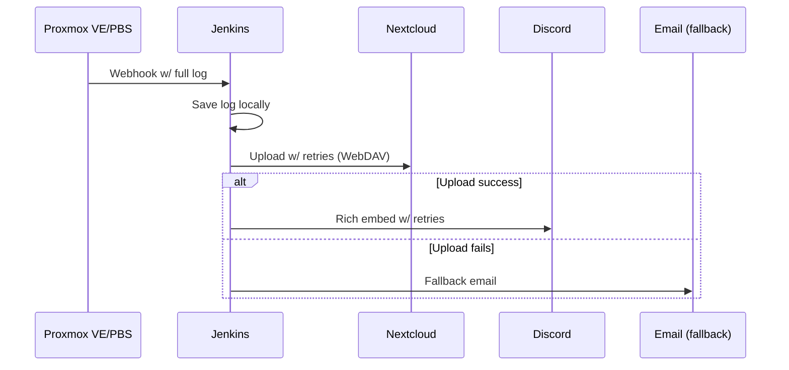

## Overview

Proxmox VE/PBS (v8.3+) has excellent webhook notifications for backups (`vzdump`), pruning, garbage collection (`gc`), verifications, and package updates. 

**The Discord limitation**: 2000-character messages vs 40-50KB backup logs = silent failures or truncation.

## The Solution: Production-Ready Pipeline

**Updated architecture** with retries, rich Discord embeds, credential secrets, and email fallbacks:



Benefits:
- Full logs preserved in Nextcloud (searchable, permanent)
- Rich Discord embeds with colors (green=success, red=failure, etc.)
- Retry logic with exponential backoff
- Secure credential injection (no plaintext secrets)
- Email fallback if Discord fails
- Zero truncation

## Prerequisites

- **Proxmox VE/PBS** (≥8.3): Enable webhook notifications.
- **Jenkins** (latest LTS, e.g., 2.426.x):
    - Install plugins: Credentials Binding, Mailer (for email), Pipeline: Utility Steps.
    - Create credentials:
        - nextcloud-user: Username (kind: Username with password).
        - nextcloud-password: Password (kind: Secret text) – wait, better: Use a single "Username with password" credential for Nextcloud.
        - discord-webhook: Webhook URL (kind: Secret text).
        - (Optional) email-credentials: SMTP details if using email fallback.
- **Nextcloud** (≥16):
    - Dedicated folder `/BACKUP-LOGS`.
    - Enable WebDAV.
    - For robustness, ensure it's highly available (e.g., behind a reverse proxy).
- **Discord**: Webhook in a channel.
- **Email** (Optional): Configure Jenkins global mailer (Admin → Configure System → Email Notification).

Test connectivity: From Jenkins agent,  `curl` should reach Nextcloud and Discord.

## Pipeline Configuration

### Nextcloud Setup

- Create dedicated user
- Create folder: BACKUP-LOGS
- Note WebDAV path: https://nextcloud.tld/remote.php/dav/files/backup-bot/BACKUP-LOGS/

###  Jenkins Credentials

| ID                     | Type              | Purpose             |
| ---------------------- | ----------------- | ------------------- |
| nextcloud-creds        | Username/Password | Nextcloud auth      |
| discord-webhook-secret | Secret Text       | Discord webhook URL |

### Create Jenkins Pipeline Job

Job name: proxmox-log-processor

Parameters (only non-secrets):

```
X_STATE (string)      - Notification state
X_LOG_CONTENT (text)  - Full Proxmox log
X_FQDN (string)       - nextcloud.example.com
X_TYPE (string)       - vzdump/prune/gc/etc
X_HOST (string)       - pve-node1
```

### Pipeline Script

```groovy
pipeline {
    agent any

    parameters {
        string(name: 'X_STATE', defaultValue: '', description: 'Notification severity (info/error/notice/warning/unknown)')
        text(name: 'X_LOG_CONTENT', defaultValue: 'If you are reading this outside of Jenkins, something went wrong', description: 'Full log content from Proxmox')
        string(name: 'X_FQDN', defaultValue: '', description: 'Nextcloud FQDN (e.g. nextcloud.example.com)')
        string(name: 'X_TYPE', defaultValue: '', description: 'Action type (vzdump, prune, gc, verification, package-updates)')
        string(name: 'X_HOST', defaultValue: '', description: 'Proxmox hostname')
    }

    environment {
        X_BACKUP_TIMESTAMP = new Date().format("yyyy-MM-dd_HH-mm-ss", TimeZone.getTimeZone('UTC'))
        X_FORMATTED_TIMESTAMP = new Date().format("dd/MM/yyyy", TimeZone.getTimeZone('UTC'))
        NEXTCLOUD_FOLDER = 'BACKUP-LOGS'
        RETRY_COUNT = 3
        RETRY_DELAY = 10
        EMAIL_RECIPIENTS = 'your.email@example.com'
    }

    stages {
        stage('Initialization & Validation') {
            steps {
                script {
                    echo "Pipeline started at ${env.X_BACKUP_TIMESTAMP} (UTC)"
                    if (!params.X_LOG_CONTENT?.trim()) {
                        error "No log content received"
                    }
                    if (!params.X_FQDN || !params.X_HOST || !params.X_TYPE || !params.X_STATE) {
                        error "Missing required parameters"
                    }
                }
            }
        }

        stage('Save Log Locally') {
            steps {
                script {
                    def logFileName = "${params.X_TYPE}-log-${env.X_BACKUP_TIMESTAMP}.log"
                    writeFile file: logFileName, text: params.X_LOG_CONTENT
                    env.LOG_FILE = logFileName
                }
            }
        }

        stage('Upload to Nextcloud with Retries') {
            steps {
                withCredentials([usernamePassword(credentialsId: 'nextcloud-creds', usernameVariable: 'NC_USER', passwordVariable: 'NC_PASS')]) {
                    script {
                        def nextcloudURL = "https://${params.X_FQDN}/remote.php/dav/files/${NC_USER}/${env.NEXTCLOUD_FOLDER}/${env.LOG_FILE}"
                        
                        // Retry logic with exponential backoff
                        def success = false
                        def delay = env.RETRY_DELAY.toInteger()
                        
                        for (int attempt = 1; attempt <= env.RETRY_COUNT.toInteger(); attempt++) {
                            try {
                                sh "curl --fail -u '${NC_USER}:${NC_PASS}' -T './${env.LOG_FILE}' '${nextcloudURL}'"
                                success = true
                                break
                            } catch (Exception e) {
                                echo "Upload attempt ${attempt} failed. Retrying in ${delay}s..."
                                sleep(delay)
                                delay *= 2
                            }
                        }
                        
                        if (!success) {
                            error "Nextcloud upload failed after ${env.RETRY_COUNT} attempts"
                        }
                        
                        env.PROTECTED_URL = nextcloudURL
                    }
                }
            }
        }

        stage('Send Discord Notification with Retries') {
            steps {
                withCredentials([string(credentialsId: 'discord-webhook-secret', variable: 'DISCORD_WEBHOOK')]) {
                    script {
                        def actionType = [
                            'package-updates': 'Package Updates',
                            'prune': 'Pruning', 
                            'gc': 'Garbage Collection',
                            'verification': 'Verification',
                            'vzdump': 'Backup'
                        ].get(params.X_TYPE) ?: 'Action'

                        def color = '#00FF00'  // Default green
                        def stateMessage
                        
                        switch(params.X_STATE) {
                            case 'info':
                                stateMessage = "${actionType} for **${params.X_HOST}** on ${env.X_FORMATTED_TIMESTAMP} **✓ completed successfully**."
                                break
                            case 'error':
                                stateMessage = "${actionType} for **${params.X_HOST}** on ${env.X_FORMATTED_TIMESTAMP} **✗ FAILED**."
                                color = '#FF0000'
                                break
                            case 'notice':
                                stateMessage = "${actionType} for **${params.X_HOST}** on ${env.X_FORMATTED_TIMESTAMP} **⚠ completed with errors**."
                                color = '#FFA500'
                                break
                            case 'warning':
                                stateMessage = "${actionType} for **${params.X_HOST}** on ${env.X_FORMATTED_TIMESTAMP} **! completed with warnings**."
                                color = '#FFFF00'
                                break
                            default:
                                stateMessage = "${actionType} for **${params.X_HOST}** on ${env.X_FORMATTED_TIMESTAMP}: **${params.X_STATE}**"
                                color = '#808080'
                        }

                        def payload = groovy.json.JsonOutput.toJson([
                            embeds: [[
                                title: stateMessage,
                                description: "🔗 **Full log**: ${env.PROTECTED_URL}",
                                color: Integer.parseInt(color.substring(1), 16),
                                timestamp: new Date().toInstant().toString(),
                                footer: [text: "Proxmox → Jenkins → Nextcloud"]
                            ]]
                        ])

                        // Discord retry logic
                        def success = false
                        def delay = env.RETRY_DELAY.toInteger()
                        
                        for (int attempt = 1; attempt <= env.RETRY_COUNT.toInteger(); attempt++) {
                            try {
                                sh "curl -H 'Content-Type: application/json' -d '${payload}' '${DISCORD_WEBHOOK}'"
                                success = true
                                break
                            } catch (Exception e) {
                                echo "Discord attempt ${attempt} failed. Retrying..."
                                sleep(delay)
                                delay *= 2
                            }
                        }

                        if (!success) {
                            emailext (
                                subject: "Proxmox ${params.X_TYPE}: ${params.X_STATE}",
                                body: "${stateMessage}\n\n${env.PROTECTED_URL}",
                                to: env.EMAIL_RECIPIENTS
                            )
                        }
                    }
                }
            }
        }
    }

    post {
        always {
            cleanWs()
        }
        failure {
            emailext (
                subject: "❌ Jenkins: Proxmox Pipeline Failed",
                body: "Check Jenkins logs for details.",
                to: env.EMAIL_RECIPIENTS
            )
        }
    }
}
```

### Proxmox Config

Datacenter → Notifications → Targets → Add → Webhook

```
Name: jenkins-logs
URL: http://jenkins.example.com/job/proxmox-log-processor/buildWithParameters?token=YOUR_BUILD_TOKEN

Payload:
{
  "X_STATE": "{{ severity }}",
  "X_LOG_CONTENT": "{{ escape message }}", 
  "X_FQDN": "nextcloud.secsys.site",
  "X_TYPE": "{{ fields.type }}",
  "X_HOST": "{{node}}"
}
```