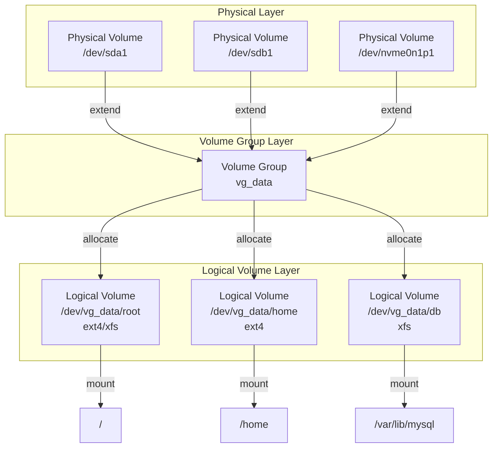
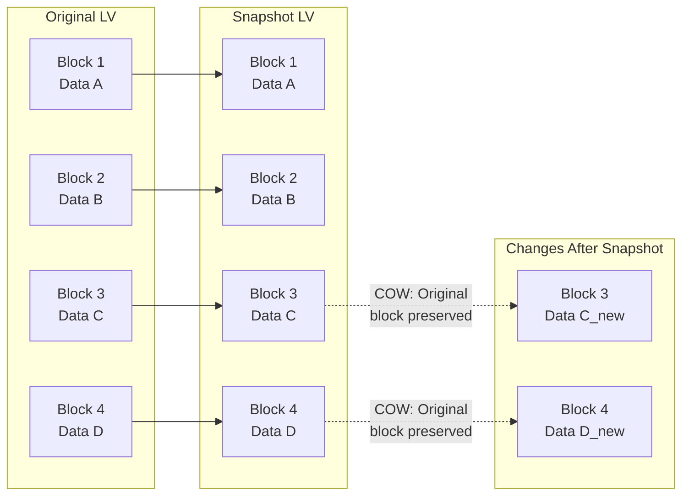
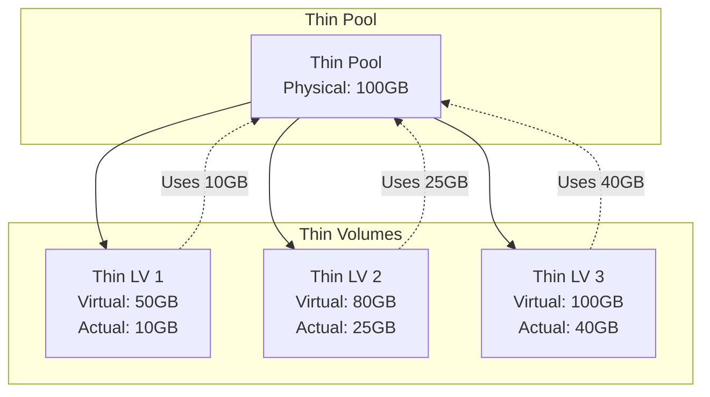
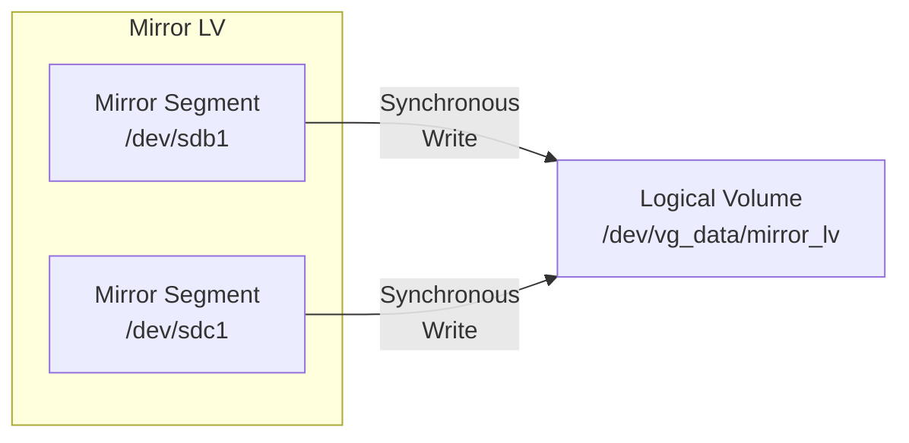
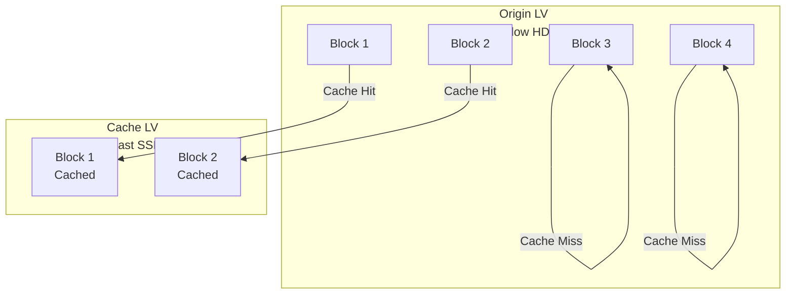
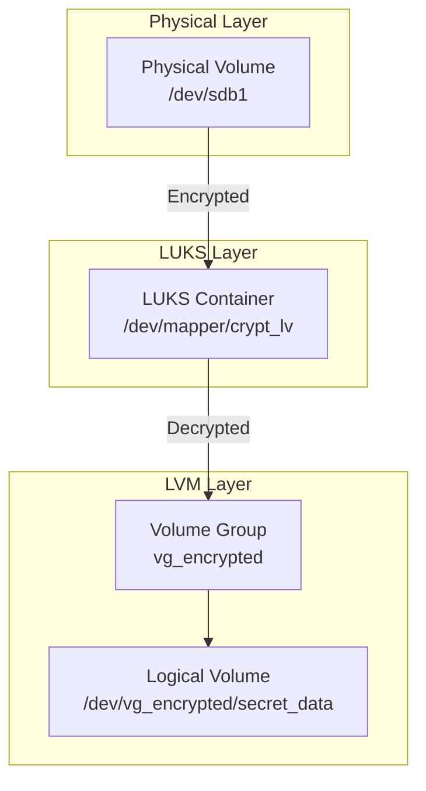

# LVM Cheat Sheet: Complete Guide from Basics to Advanced Techniques

Logical Volume Manager (LVM) is a powerful storage management solution that provides flexibility and advanced features beyond traditional disk partitioning. Whether you're managing a single server or an enterprise infrastructure, understanding LVM is essential for modern system administration.

## Table of Contents

- [What is LVM?](#what-is-lvm)
- [LVM Architecture](#lvm-architecture)
- [Basic LVM Operations](#basic-lvm-operations)
  - [Physical Volumes (PV)](#physical-volumes-pv)
  - [Volume Groups (VG)](#volume-groups-vg)
  - [Logical Volumes (LV)](#logical-volumes-lv)
- [Common Tasks](#common-tasks)
  - [Extending Logical Volumes](#extending-logical-volumes)
  - [Reducing Logical Volumes](#reducing-logical-volumes)
  - [Moving Data Between Disks](#moving-data-between-disks)
- [Advanced LVM Features](#advanced-lvm-features)
  - [LVM Snapshots](#lvm-snapshots)
  - [Thin Provisioning](#thin-provisioning)
  - [LVM Mirroring (RAID 1)](#lvm-mirroring-raid-1)
  - [LVM Caching](#lvm-caching)
  - [LVM Encryption](#lvm-encryption)
- [Practical Use Cases](#practical-use-cases)
- [Troubleshooting](#troubleshooting)
- [Best Practices](#best-practices)

---

## What is LVM?

LVM adds a layer of abstraction between your physical storage and the filesystem. Instead of dealing with fixed partitions, you can dynamically allocate, resize, and manage storage space.

**Key Benefits:**
- **Flexibility**: Resize volumes without unmounting
- **Snapshot capability**: Create point-in-time copies for backups
- **Thin provisioning**: Allocate space on-demand
- **Storage pooling**: Combine multiple disks into a single pool
- **Live migration**: Move data while the system is running
- **RAID functionality**: Software RAID without hardware requirements

---

## LVM Architecture

LVM uses a three-layer architecture:



**Layer Breakdown:**

1. **Physical Volume (PV)**: The actual disk or partition (e.g., `/dev/sda1`)
2. **Volume Group (VG)**: A pool of storage created from one or more PVs
3. **Logical Volume (LV)**: Virtual partitions carved out of the VG

---

## Basic LVM Operations

### Physical Volumes (PV)

**Create a Physical Volume**

```bash
# Initialize a disk/partition for LVM use
pvcreate /dev/sdb1

# Initialize entire disk (no partition table)
pvcreate /dev/sdc

# Initialize multiple devices
pvcreate /dev/sdd1 /dev/sde1 /dev/sdf1
```

**View Physical Volumes**

```bash
# Display all PVs
pvdisplay

# Compact display
pvs

# Show specific PV
pvdisplay /dev/sdb1

# Show PV size in human-readable format
pvs --units g
```

**Remove a Physical Volume**

```bash
# First, ensure all data is moved off the PV
pvmove /dev/sdb1

# Then remove from VG
vgreduce <volume-group-name> /dev/sdb1

# Finally, wipe LVM metadata
pvremove /dev/sdb1
```

### Volume Groups (VG)

**Create a Volume Group**

```bash
# Create VG from one or more PVs
vgcreate <vg-name> /dev/sdb1 /dev/sdc1

# Specify PE (Physical Extent) size (default 4MB)
vgcreate -s 8M <vg-name> /dev/sdb1

# Example
vgcreate vg_data /dev/sdb1 /dev/sdc1
```

**View Volume Groups**

```bash
# Display all VGs
vgdisplay

# Compact display
vgs

# Show free space in VG
vgs --units g -o +vg_free

# Show specific VG
vgdisplay vg_data
```

**Extend a Volume Group**

```bash
# Add a new PV to existing VG
vgextend vg_data /dev/sdd1

# Verify extension
vgs vg_data
```

**Reduce a Volume Group**

```bash
# Ensure no LVs are using the PV
pvmove /dev/sdb1

# Remove PV from VG
vgreduce vg_data /dev/sdb1
```

**Remove a Volume Group**

```bash
# First, deactivate and remove all LVs
lvremove /dev/vg_data/<lv-name>

# Then remove VG
vgremove vg_data
```

### Logical Volumes (LV)

**Create a Logical Volume**

```bash
# Create LV with specific size
lvcreate -L 10G -n lv_name vg_name

# Create LV using percentage of VG free space
lvcreate -l 100%FREE -n lv_name vg_name
lvcreate -l 50%VG -n lv_name vg_name

# Create LV with specific number of extents
lvcreate -l 100 -n lv_name vg_name

# Example
lvcreate -L 20G -n root vg_data
```

**View Logical Volumes**

```bash
# Display all LVs
lvdisplay

# Compact display
lvs

# Show specific LV
lvdisplay /dev/vg_data/root

# Show LV with path
lvs -o +lv_path
```

**Remove a Logical Volume**

```bash
# WARNING: This deletes all data in LV!
lvremove /dev/vg_data/lv_name

# Or use VG and LV name
lvremove vg_data/lv_name
```

---

## Common Tasks

### Extending Logical Volumes

**Scenario**: Increase filesystem size without downtime

```bash
# Step 1: Extend the logical volume
# Option A: Add specific size
lvextend -L +5G /dev/vg_data/root

# Option B: Use all free space
lvextend -l +100%FREE /dev/vg_data/root

# Option C: Extend to specific size
lvextend -L 30G /dev/vg_data/root

# Step 2: Resize the filesystem
# For ext4 (online resize)
resize2fs /dev/vg_data/root

# For xfs (online resize)
xfs_growfs /mount/point

# For btrfs (online resize)
btrfs filesystem resize max /mount/point

# Step 3: Verify
df -h
```

**Complete Example:**

```bash
# Check current size
lvs vg_data/root
Filesystem             Size  Origin Snap%  Move Log Cpy%Sync Convert

# Extend LV by 10GB
lvextend -L +10G vg_data/root
  Size of logical volume vg_data/root changed from 20.00 GiB to 30.00 GiB.

# Resize ext4 filesystem
resize2fs /dev/vg_data/root
resize2fs 1.47.0 (5-Feb-2023)
Filesystem at /dev/vg_data/root is mounted on /; on-line resizing required
old_desc_blocks = 4, new_desc_blocks = 6
The filesystem on /dev/vg_data/root is now 7864320 (4k) blocks long.

# Verify
df -h /dev/vg_data/root
Filesystem             Size  Used Avail Use% Mounted on
/dev/mapper/vg_data-root  30G   12G   17G  42% /
```

### Reducing Logical Volumes

**⚠️ WARNING**: Always backup data before reducing. Filesystem must be unmounted or mounted read-only.

```bash
# Step 1: Check filesystem
# For ext4: unmount first or use read-only
umount /mount/point

# Check filesystem integrity
e2fsck -f /dev/vg_data/lv_name

# Step 2: Reduce filesystem size (shrink filesystem first!)
# For ext4: reduce to 15GB
resize2fs /dev/vg_data/lv_name 15G

# Step 3: Reduce logical volume
lvreduce -L 15G /dev/vg_data/lv_name

# Confirm reduction (type 'y')
lvreduce -L 15G /dev/vg_data/lv_name
  WARNING: Reducing active logical volume to 15.00 GiB.
  THIS MAY DESTROY YOUR DATA (filesystem may be damaged)
  Do you really want to reduce vg_data/lv_name? [y/n]: y
  Size of logical volume vg_data/lv_name changed from 20.00 GiB to 15.00 GiB.

# Step 4: Remount and verify
mount /dev/vg_data/lv_name /mount/point
df -h
```

### Moving Data Between Disks

**Scenario**: Replace old disk with new, larger disk

```bash
# Step 1: Add new PV to VG
pvcreate /dev/sdd1
vgextend vg_data /dev/sdd1

# Step 2: Move data from old PV to new PV
pvmove /dev/sdb1

# This may take time depending on data size
# Monitor progress:
watch -n 5 pvs

# Step 3: Remove old PV from VG
vgreduce vg_data /dev/sdb1

# Step 4: (Optional) Remove PV metadata
pvremove /dev/sdb1
```

**Move specific LV to specific PV:**

```bash
# Move only lv_home to /dev/sdd1
pvmove -n lv_home /dev/sdb1 /dev/sdd1
```

---

## Advanced LVM Features

### LVM Snapshots

Snapshots provide point-in-time copies of logical volumes using copy-on-write (COW).



**Create a Snapshot**

```bash
# Create snapshot with 10% of original LV size
lvcreate -s -n snap_name -L 10G /dev/vg_data/lv_original

# Create snapshot using percentage of LV size
lvcreate -s -n snap_name -l 20%ORIGIN /dev/vg_data/lv_original

# Example
lvcreate -s -n root_snap -L 5G vg_data/root
```

**Mount and Use Snapshot**

```bash
# Mount snapshot (read-only recommended)
mount -o ro /dev/vg_data/root_snap /mnt/snapshot

# Access files from snapshot
ls /mnt/snapshot/home/

# Unmount when done
umount /mnt/snapshot
```

**Merge Snapshot (Rollback)**

```bash
# Merge snapshot back to original (requires lvm2 >= 2.02.89)
lvconvert --merge vg_data/root_snap

# If LV is active, reboot required or deactivate first
lvconvert --merge vg_data/root_snap
# Reboot to complete merge

# Or merge while active (if supported)
umount /dev/vg_data/root
lvconvert --merge vg_data/root_snap
mount /dev/vg_data/root /
```

**Remove Snapshot**

```bash
# First unmount if mounted
umount /dev/vg_data/root_snap

# Remove snapshot LV
lvremove vg_data/root_snap
```

**Snapshot Use Cases:**

- **Backups**: Create snapshot, backup from snapshot while LV remains active
- **Testing**: Test changes, rollback if needed
- **Consistent Data**: Quiesce database, create snapshot, backup

**Snapshot Limitations:**

- Snapshot size limits number of changes before full copy
- Performance overhead on write-heavy workloads
- Cannot resize snapshot independently
- Requires sufficient free space in VG

---

### Thin Provisioning

Thin provisioning allows overcommitting storage - allocate virtual space larger than physical space.



**Create Thin Pool**

```bash
# Step 1: Create thin pool LV (metadata + data)
# Create metadata LV (usually 1% of pool size)
lvcreate -L 1G -n thinpool_meta vg_data

# Create data LV (remaining space)
lvcreate -L 99G -n thinpool_data vg_data

# Step 2: Convert to thin pool
lvconvert -y --zero n -c 512K --thinpool vg_data/thinpool_data \
          --poolmetadata vg_data/thinpool_meta vg_data/thinpool_data

# Or create thin pool in one command (lvm2 >= 2.02.115)
lvcreate -L 100G -T vg_data/thinpool
```

**Create Thin Volume**

```bash
# Create thin volume from thin pool
lvcreate -V 500G -T vg_data/thinpool -n thin_vol1

# -V specifies virtual size (can exceed pool size)
# Actual space allocated on-demand

# Create multiple thin volumes
lvcreate -V 200G -T vg_data/thinpool -n thin_vol2
lvcreate -V 300G -T vg_data/thinpool -n thin_vol3
```

**View Thin Pool Status**

```bash
# Show thin pool metadata usage
lvs -o +data_percent,metadata_percent,thin_pool

# Example output:
# LV         VG      Attr       LSize   Data%  Meta%  Move Log Cpy%Sync Convert
# thinpool   vg_data twi-aotz-- 100.00g  45.20  12.50

# Check thin volume usage
lvs -o +thin_percent

# Monitor thin pool
lvs -a -o +seg_monitor
```

**Extend Thin Pool**

```bash
# Add more space to thin pool
lvextend -L +50G vg_data/thinpool

# Extend metadata if needed
lvextend -L +1G vg_data/thinpool_meta
```

**Thin Pool Auto-Extension**

```bash
# Configure automatic extension when pool reaches threshold
lvm.conf setting:
thin_pool_autoextend_threshold = 80
thin_pool_autoextend_percent = 20

# Or use command:
lvchange --autoextend y --poolmetadataspare 1 vg_data/thinpool
```

**Thin Snapshot**

```bash
# Create snapshot of thin volume (very efficient)
lvcreate -s -n thin_snap -V 10G vg_data/thin_vol1

# Snapshot size is virtual, actual depends on changes
```

**Thin Provisioning Best Practices:**

- Monitor pool usage closely (Data% approaching 100% = out of space)
- Keep metadata < 50% used (Meta% threshold)
- Use separate metadata LV for performance
- Set up alerts for pool capacity
- Consider overcommit ratio based on workload

---

### LVM Mirroring (RAID 1)

LVM provides software mirroring for redundancy.



**Create Mirrored LV**

```bash
# Create mirrored LV with 2 copies
lvcreate -m 1 -L 20G -n mirror_lv vg_data

# -m 1 means 1 mirror (2 total copies: original + 1 mirror)
# -m 2 would mean 2 mirrors (3 total copies)

# Specify which PVs to use
lvcreate -m 1 -L 20G -n mirror_lv vg_data /dev/sdb1 /dev/sdc1
```

**View Mirror Status**

```bash
# Show mirror sync status
lvs -o +mirror_seg,raid_sync_status

# Example:
# LV        VG      Attr       LSize   Cpy%Sync Convert
# mirror_lv vg_data mwi-aom--- 20.00g  100.00

# Detailed mirror information
lvdisplay -m /dev/vg_data/mirror_lv
```

**Repair a Failed Mirror**

```bash
# If a disk fails, remove it from mirror
lvconvert --repair vg_data/mirror_lv

# Replace failed disk and add to mirror
pvcreate /dev/sdd1
vgextend vg_data /dev/sdd1
lvconvert -m vg_data/mirror_lv /dev/sdd1
```

**Convert Linear LV to Mirrored**

```bash
# Add mirror to existing LV
lvconvert -m 1 vg_data/linear_lv

# Specify devices
lvconvert -m 1 vg_data/linear_lv /dev/sdb1 /dev/sdc1
```

**Remove Mirror**

```bash
# Remove one mirror copy (reduce to linear)
lvconvert -m 0 vg_data/mirror_lv
```

**Mirror Considerations:**

- Requires at least 2 PVs for redundancy
- Write performance overhead (synchronous writes)
- Automatic resync after failure/replacement
- Monitor sync progress with `lvs`

---

### LVM Caching

LVM can use fast SSDs to cache slower HDDs using dm-cache.



**Create Cached LV**

```bash
# Step 1: Create origin LV on slow storage
lvcreate -L 100G -n origin_lv vg_data /dev/sdb1

# Step 2: Create cache metadata LV (small, on SSD)
lvcreate -L 1G -n cache_meta vg_data /dev/nvme0n1p1

# Step 3: Create cache data LV (larger, on SSD)
lvcreate -L 20G -n cache_data vg_data /dev/nvme0n1p1

# Step 4: Convert to cache pool
lvconvert -y --type cache-pool \
          vg_data/cache_data \
          --poolmetadata vg_data/cache_meta

# Step 5: Attach cache to origin LV
lvconvert -y --type cache \
          --cachepool vg_data/cache_data \
          vg_data/origin_lv
```

**View Cache Status**

```bash
# Show cache statistics
lvs -o +cache_policy,cache_settings

# Check cache hits/misses
dmsetup status /dev/vg_data/origin_lv-cache

# Example output:
# 0 20971520 cache 0 0 1 1 0 0 0 0 0 0 0 0 0 0
# (reads: hits misses, writes: hits misses)
```

**Cache Policies**

```bash
# Set cache policy (default: smq)
lvchange --cachepolicy smq vg_data/origin_lv

# Available policies:
# - smq: Stochastic Multi-Queue (default, good for most workloads)
# - mq: Multi-Queue (better for high queue depth)
# - cleaner: Write-through (flush dirty blocks)

# Set cache mode
lvchange --cachemode writeback vg_data/origin_lv
# Modes: writethrough, writeback, passthrough

# Set cache parameters
lvchange --cachesettings 'smq_threshold=8192' vg_data/origin_lv
```

**Remove Cache**

```bash
# Detach cache (data remains on origin)
lvconvert --uncache vg_data/origin_lv

# This may take time to flush dirty blocks
```

**Caching Best Practices:**

- Cache metadata LV should be on reliable storage
- Cache size: 10-20% of origin size typically
- Monitor cache hit ratio
- Use writeback mode for performance, writethrough for safety
- Consider workload characteristics (random vs sequential)

---

### LVM Encryption

LVM integrates with LUKS for disk encryption.



**Encrypt a Logical Volume**

```bash
# Method 1: Encrypt LV directly (lvm2 >= 2.03.07)
lvcreate -L 10G -n secret_lv vg_data
lvconvert --type encrypt --cipher aes-xts-plain64 \
          --key-size 256 --hash sha256 \
          --encrypt y vg_data/secret_lv

# Enter passphrase when prompted

# Method 2: LUKS on PV, then PV to VG (more flexible)
cryptsetup luksFormat /dev/sdb1
cryptsetup open /dev/sdb1 crypt_lv
pvcreate /dev/mapper/crypt_lv
vgcreate vg_encrypted /dev/mapper/crypt_lv
lvcreate -L 10G -n data vg_encrypted
```

**Open Encrypted LV**

```bash
# If using LUKS on PV
cryptsetup open /dev/sdb1 crypt_lv --type luks

# If using LVM encryption
lvchange -ay vg_data/secret_lv
# Prompts for passphrase

# Access decrypted LV
mount /dev/vg_data/secret_lv /mnt/secret
```

**Close Encrypted LV**

```bash
# Unmount filesystem
umount /mnt/secret

# Deactivate LV
lvchange -an vg_data/secret_lv

# Or close LUKS container
cryptsetup close crypt_lv
```

**Change Passphrase**

```bash
# For LUKS on PV
cryptsetup luksChangeKey /dev/sdb1

# For LVM encryption
lvchange --keyfile /dev/vg_data/secret_lv
# Follow prompts
```

**Encryption Considerations:**

- Performance overhead (hardware AES-NI reduces impact)
- Key management: store keys securely
- Backup LUKS headers: `cryptsetup luksHeaderBackup`
- Consider TPM integration for automated unlocking
- Use strong ciphers and key sizes

---

## Practical Use Cases

### Use Case 1: Dynamic Web Server Storage

```bash
# Create VG for web data
vgcreate vg_web /dev/sdb1 /dev/sdc1

# Create thin pool for flexible growth
lvcreate -L 50G -T vg_web/thinpool

# Create thin volumes for each site
lvcreate -V 20G -T vg_web/thinpool -n site1
lvcreate -V 30G -T vg_web/thinpool -n site2

# Format and mount
mkfs.xfs /dev/vg_web/site1
mkfs.xfs /dev/vg_web/site2

# Add to /etc/fstab
echo "/dev/vg_web/site1 /var/www/site1 xfs defaults 0 0" >> /etc/fstab
echo "/dev/vg_web/site2 /var/www/site2 xfs defaults 0 0" >> /etc/fstab
```

### Use Case 2: Database with Snapshots

```bash
# Create VG for database
vgcreate vg_db /dev/sdd1 /dev/sde1

# Create LV for database
lvcreate -L 100G -n mysql_data vg_db
mkfs.xfs /dev/vg_db/mysql_data

# Mount and configure MySQL
mount /dev/vg_db/mysql_data /var/lib/mysql

# Daily backup using snapshot
lvcreate -s -n mysql_snap -l 100%FREE vg_db/mysql_data
mount -o ro /dev/vg_db/mysql_snap /mnt/backup
# Backup /mnt/backup
umount /mnt/backup
lvremove vg_db/mysql_snap
```

### Use Case 3: Expand Root Filesystem (Proxmox Example)

```bash
# From your existing post:
# 1. Resize disk in Proxmox GUI
# 2. Resize partition: parted resizepart 3 100%
# 3. Resize PV: pvresize /dev/sda3
# 4. Extend LV: lvextend -r -l +100%FREE /dev/mapper/pbs-root
# 5. Verify: df -h
```

### Use Case 4: Live Migration to New Storage

```bash
# Add new disk
pvcreate /dev/sdf1
vgextend vg_data /dev/sdf1

# Move data from old to new disk
pvmove /dev/sdb1

# Remove old disk
vgreduce vg_data /dev/sdb1
pvremove /dev/sdb1

# Now can physically remove old disk
```

---

## Troubleshooting

### Common Issues and Solutions

**Issue 1: "Insufficient free space" when creating LV**

```bash
# Check VG free space
vgs vg_name

# Check PVs in VG
pvs

# Add more space:
# 1. Add new disk: pvcreate /dev/sdd1
# 2. Extend VG: vgextend vg_name /dev/sdd1
# 3. Retry lvcreate
```

**Issue 2: LV won't reduce - "Filesystem is mounted"**

```bash
# Unmount first
umount /mount/point

# Or use rescue mode if root filesystem
# Boot from live CD, then reduce

# For xfs: cannot shrink, must backup and recreate
```

**Issue 3: Snapshot fills up and LV becomes read-only**

```bash
# Monitor snapshot usage
lvs -o +thin_percent

# Extend snapshot if needed
lvextend -L +5G /dev/vg_data/snap_name

# Or remove and recreate larger snapshot
```

**Issue 4: "Device is busy" when removing PV**

```bash
# Check what's using the PV
pvs -o+pv_used

# Move data off PV
pvmove /dev/sdb1

# Wait for completion, then retry vgreduce
```

**Issue 5: LVM commands not found**

```bash
# Install LVM2
# Debian/Ubuntu:
apt-get install lvm2

# RHEL/CentOS:
yum install lvm2

# Start LVM services
systemctl enable --now lvm2-lvmetad
systemctl enable --now lvm2-lvmpolld
```

**Issue 6: Boot problems after LVM changes**

```bash
# Check initramfs includes LVM
update-initramfs -u  # Debian/Ubuntu
dracut -f           # RHEL/CentOS

# Verify /etc/fstab uses correct LV paths
cat /etc/fstab

# Test LVM activation
vgchange -ay
```

**Recovery Commands**

```bash
# Scan for PVs
pvscan

# Activate all LVs
vgchange -ay

# Deactivate all LVs
vgchange -an

# Check LVM metadata backup
vgcfgrestore -f /etc/lvm/archive/vg_name_*.vg vg_name

# Restore from backup if VG corrupted
vgcfgrestore vg_name
```

---

## Best Practices

### 1. **Naming Conventions**

```bash
# Use descriptive names
vg_name: vg_data, vg_root, vg_web
lv_name: lv_mysql, lv_postgres, lv_logs

# Avoid spaces and special characters
# Use underscores or hyphens
```

### 2. **PE Size Selection**

```bash
# Default: 4MB (good for most cases)
# For large LVs (>1TB), consider larger PE:
vgcreate -s 8M vg_name /dev/sdb1

# For many small LVs, smaller PE reduces waste:
vgcreate -s 1M vg_name /dev/sdb1
```

### 3. **Filesystem Choice**

```bash
# XFS: Best for large files, high performance, cannot shrink
mkfs.xfs /dev/vg_name/lv_name

# EXT4: Can shrink, journaling, good general purpose
mkfs.ext4 /dev/vg_name/lv_name

# Btrfs: Snapshots, compression, RAID (still experimental)
mkfs.btrfs /dev/vg_name/lv_name
```

### 4. **Monitoring**

```bash
# Add to crontab for regular monitoring
*/5 * * * * /usr/bin/lvs --units g >> /var/log/lvm_monitor.log

# Set up alerts for thin pool usage
# Alert if Data% > 90%
lvs --noheadings -o vg_name,lv_name,data_percent | \
  awk '$3 > 90 { print "ALERT: " $0 }'
```

### 5. **Backup LVM Configuration**

```bash
# Backup LVM metadata (automatic, but verify)
ls /etc/lvm/archive/

# Manual backup
vgcfgbackup vg_name

# Restore if needed
vgcfgrestore vg_name
```

### 6. **Performance Tuning**

```bash
# Set I/O scheduler for SSD
echo 'noop' > /sys/block/sdX/queue/scheduler

# For HDD, use 'deadline' or 'cfq'

# Adjust read_ahead
blockdev --setra 256 /dev/mapper/vg_name-lv_name

# Monitor I/O
iostat -x 1
```

### 7. **Security**

```bash
# Restrict LVM commands to root
chmod 700 /usr/sbin/lvm

# Use SELinux/AppArmor for LVM
# Enable LVM encryption for sensitive data

# Audit LVM commands
auditctl -w /usr/sbin/lvcreate -p x -k lvm
```

### 8. **Documentation**

```bash
# Document your LVM layout
lvs -o +lv_attr > lvm_layout.txt
pvs >> lvm_layout.txt
vgs >> lvm_layout.txt

# Keep in /root or version control
```

---

## Quick Reference Commands

### Physical Volumes
```bash
pvcreate /dev/sdb1              # Create PV
pvdisplay                      # Show all PVs
pvs                            # Compact PV list
pvremove /dev/sdb1             # Remove PV
pvmove /dev/sdb1               # Move data off PV
```

### Volume Groups
```bash
vgcreate vg_data /dev/sdb1     # Create VG
vgextend vg_data /dev/sdc1     # Extend VG
vgdisplay vg_data              # Show VG
vgs                           # Compact VG list
vgreduce vg_data /dev/sdb1     # Remove PV from VG
vgremove vg_data               # Delete VG
```

### Logical Volumes
```bash
lvcreate -L 10G -n lv_root vg_data    # Create 10GB LV
lvcreate -l 100%FREE -n lv_new vg_data # Use all free space
lvdisplay /dev/vg_data/lv_root        # Show LV
lvs                                  # Compact LV list
lvextend -L +5G /dev/vg_data/lv_root # Extend LV by 5GB
lvreduce -L 15G /dev/vg_data/lv_root # Reduce to 15GB
lvremove /dev/vg_data/lv_root         # Delete LV
```

### Snapshots
```bash
lvcreate -s -n snap_name -L 5G /dev/vg_data/lv_original  # Create
mount -o ro /dev/vg_data/snap_name /mnt/snap             # Mount
lvconvert --merge vg_data/snap_name                      # Merge
lvremove vg_data/snap_name                               # Delete
```

### Thin Provisioning
```bash
lvcreate -L 100G -T vg_data/thinpool                    # Create thin pool
lvcreate -V 500G -T vg_data/thinpool -n thin_vol        # Create thin LV
lvs -o +data_percent,thin_percent                       # Check usage
lvextend -L +50G vg_data/thinpool                       # Extend pool
```

### Resizing Filesystems
```bash
resize2fs /dev/vg_data/lv_root      # ext4 (online)
xfs_growfs /mount/point             # XFS (online)
btrfs filesystem resize max /mount/point  # Btrfs
```

---

## Conclusion

LVM is an indispensable tool for modern system administration. From simple disk management to advanced features like thin provisioning, snapshots, and caching, LVM provides the flexibility needed in dynamic environments.

**Key Takeaways:**

1. **Start with basics**: Master PV → VG → LV workflow
2. **Use snapshots**: Essential for backups and testing
3. **Consider thin provisioning**: Efficient space utilization
4. **Plan for growth**: Leave free space in VGs
5. **Monitor regularly**: Especially thin pools and mirrors
6. **Document everything**: LVM layouts can get complex
7. **Test in lab**: Advanced features need practice

**Next Steps:**

- Set up a test environment to practice LVM operations
- Experiment with snapshots and thin provisioning
- Implement LVM in your infrastructure gradually
- Monitor performance and adjust configurations
- Stay updated with LVM2 developments

---

## Additional Resources

- **Man pages**: `man lvm`, `man pvcreate`, `man vgcreate`, `man lvcreate`
- **Official docs**: https://sourceware.org/lvm2/
- **Tutorials**: https://tldp.org/HOWTO/LVM-HOWTO/
- **Community**: https://access.redhat.com/documentation/en-us/red_hat_enterprise_linux/

---

*Happy Volume Managing!* 🐧
